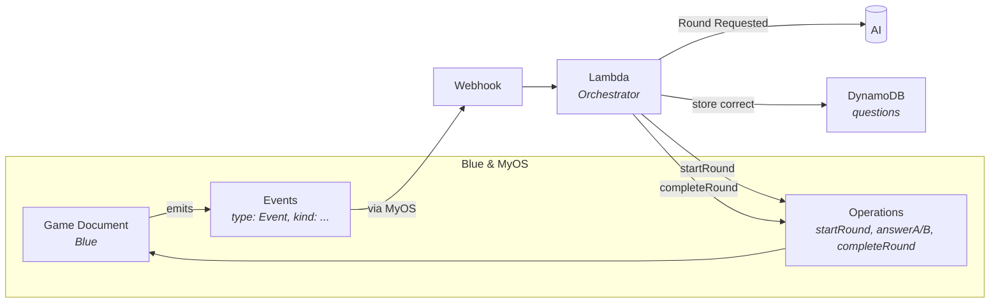
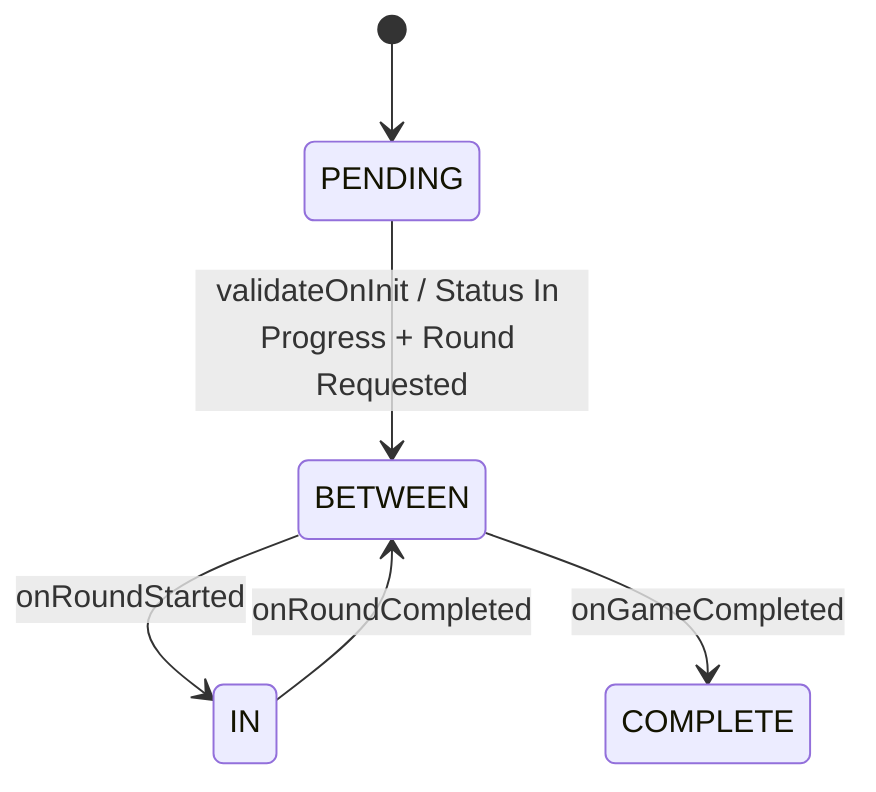
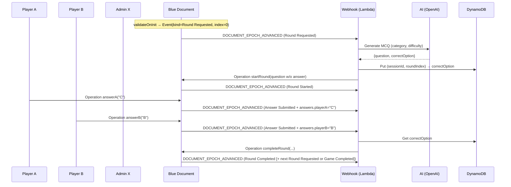
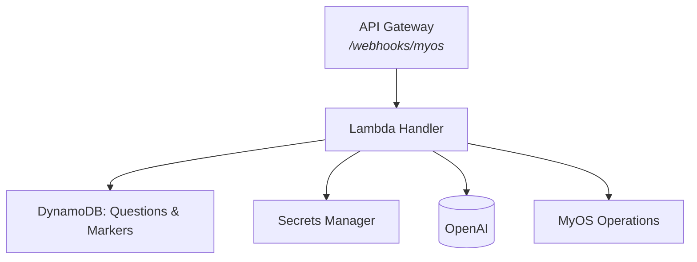

# myos-quiz

**AI Multiplayer Quiz** — a compact, serverless integration that connects **Blue documents** in **MyOS** with **AI‑generated multiple-choice questions**. It demonstrates how to model quiz logic in Blue, orchestrate with MyOS timelines/events, and plug in AI—cleanly and safely.

> **What you’ll see:** A starts a game, X (admin) receives document events, the backend asks AI for a question, players A & B answer, the document scores, and the game advances round by round—**all driven by events**.

---

## Table of contents

* [Why this demo](#why-this-demo)
* [How it works (at a glance)](#how-it-works-at-a-glance)
* [Blue document: quiz design](#blue-document-quiz-design)

  * [Channels](#channels)
  * [Operations](#operations)
  * [Events (type/kind pattern)](#events-typekind-pattern)
  * [Workflows (state machine)](#workflows-state-machine)
  * [Document fields](#document-fields)
* [Backend orchestrator](#backend-orchestrator)

  * [End‑to‑end flow of a round](#end-to-end-flow-of-a-round)
  * [What the backend never stores](#what-the-backend-never-stores)
* [Architecture (AWS CDK)](#architecture-aws-cdk)
* [Deploy & run](#deploy--run)
* [Try the demo](#try-the-demo)
* [Extending the quiz](#extending-the-quiz)
* [Resilience add‑ons (brief)](#resilience-add-ons-brief)
* [Troubleshooting](#troubleshooting)
* [FAQ](#faq)

---

## Why this demo

* **Blue** lets you define **typed, event‑driven documents** with guarded operations and workflows. We model the full trivia game logic right in the document.
* **MyOS** provides **timelines** and **webhooks**. Your backend stays **stateless** and reacts to `DOCUMENT_EPOCH_ADVANCED` events.
* **AI** (OpenAI) generates structured, 4‑option MCQs by category and difficulty. The **correct answer is kept off‑document** during a round to prevent peeking.

This repo shows a **pattern** you can reuse for any event‑driven integration: **document = source of truth**, **backend = thin orchestrator**.

---

## How it works (at a glance)



* **Document emits events** (e.g., `Round Requested`, `Answer Submitted`).
* **Webhook** sends the event snapshot to the **Lambda**.
* Lambda **generates or completes** rounds by calling **MyOS operations** on the document.
* **AI** is used to generate questions; **correct answers** are stored **off‑document** in DynamoDB until the round ends.

---

## Blue document: quiz design

Check unit test: [test/unit/blue-document.spec.ts](./test/unit/blue-document.spec.ts) to see example document and flow of events.

The game uses a **single generic event type** with a discriminator:

```yaml
type: Event
kind: <Round Started | Round Requested | Answer Submitted | Round Completed | Game Completed | Status Change>
```

### Channels

* `adminChannel` — bound to **X** (game admin).
* `playerAChannel` — bound to **A**.
* `playerBChannel` — bound to **B**.

> Channels are bound at **bootstrap** time (initiator provides MyOS account/timeline IDs).

### Operations

> **Guarded, emit‑only.** Operations validate context and **emit events**; **workflows** apply mutations. Unexpected calls are safely ignored.

* `startRound` (admin): accepts `{ roundIndex, question{ questionId, category, level, prompt, options{A..D} } }`
  Guarded to only start the **expected** next round.
* `answerA` / `answerB` (players): accept `"A" | "B" | "C" | "D"`
  Guarded to only accept **once per player** while `phase === "IN_ROUND"`.
* `completeRound` (admin): accepts `{ roundIndex, questionId, correctOption, explanation }`
  Guarded to only complete the **current** round and **matching questionId**.

### Events (type/kind pattern)

All custom events use the **generic event** shape:

```json
{ "type": "Event", "kind": "Round Requested", "nextRoundIndex": 1 }
{ "type": "Event", "kind": "Round Started", "roundIndex": 0, "question": { ... } }
{ "type": "Event", "kind": "Answer Submitted", "player": "playerA", "choice": "C" }
{ "type": "Event", "kind": "Round Completed", "results": { ... } }
{ "type": "Event", "kind": "Game Completed", "winners": ["playerA"], "scoreboard": { ... } }
```

### Workflows (state machine)

> **Operations emit → workflows mutate** (pure event handling): predictable and testable.



* `validateOnInit` (lifecycle): validates inputs and emits `Status Change: In Progress` + `Round Requested (0)`.
* `onRoundStarted`: sets `status=In Progress`, `phase=IN_ROUND`, writes `currentQuestion` and resets `answers`.
* `onAnswerSubmittedA/B`: writes the player’s answer under `/answers`.
* `onRoundCompleted`: updates `scoreboard`, `lastRoundResult`, clears `currentQuestion`, sets `phase=BETWEEN_ROUNDS`, and (if more rounds) emits `Round Requested (next)`.
* `onGameCompleted`: sets `status=Completed`, writes `winners`, `phase=GAME_COMPLETED`.

### Document fields

| Field             | Type / Example                                     | Notes                             |
| ----------------- | -------------------------------------------------- | --------------------------------- |
| `roundsTotal`     | `Integer`                                          | total rounds                      |
| `categories`      | `List<Text>`                                       | allowed categories                |
| `level`           | `Integer (0..2)`                                   | difficulty (0 easy, 2 hard)       |
| `roundIndex`      | `Integer` (default `0`)                            | current index                     |
| `phase`           | `IN_ROUND \| BETWEEN_ROUNDS \| GAME_COMPLETED`     | control guard                     |
| `status`          | `Document Status`                                  | Pending/In Progress/Completed     |
| `scoreboard`      | `Dict<Text,Integer>` → `{ playerA, playerB }`      | cumulative points                 |
| `currentQuestion` | `{ questionId, category, level, prompt, options }` | **No correct answer** stored here |
| `answers`         | `{ playerA?: 'A'..'D', playerB?: 'A'..'D' }`       | per‑round answers                 |
| `lastRoundResult` | snapshot of last round                             | includes `correctOption`          |

---

## Backend orchestrator

The webhook handler ingests **epoch snapshots** (`DOCUMENT_EPOCH_ADVANCED` payload that includes `document` and emitted events) and runs a tiny **Orchestrator** service:

* On **`Round Requested`** → **generate** question with AI → store `correctOption` in DynamoDB → call `startRound`.
* On **`Answer Submitted`** (or `Round Started`) → if both answers exist and `phase==='IN_ROUND'` → **complete** round (use stored `correctOption`).

The backend keeps **no game state** beyond the per‑round correct answer.

### End‑to‑end flow of a round



### What the backend never stores

* **Never** stores `answers` or document state (that’s the doc’s job).
* **Never** stores `correctOption` inside the document **before** completion.
* Only stores **correct answer off‑doc** per round.

---

## Architecture (AWS CDK)

* **API Gateway (HTTP API)** → **Lambda (Node 20)** runs the webhook handler.
* **DynamoDB** (questions table) holds per‑round correct answers.
* **Secrets Manager** stores `OPENAI_API_KEY`, `MYOS_API_KEY`, optional webhook secret.
* **Powertools** (Logger/Tracer/Metrics) for observability.



---

## Deploy & run

```bash
pnpm i
pnpm -w build
pnpm -w test
pnpm -w --filter infra cdk:bootstrap
pnpm -w --filter infra cdk:deploy -- --context stage=dev # initial deploy you might need to do by `cd infra && npx cdk deploy --context stage=dev --require-approval never`
```

**Set secrets and env (examples):**

```bash
# Secrets
aws secretsmanager put-secret-value --secret-id /myos-quiz/dev/OPENAI_API_KEY --secret-string 'sk-...'
aws secretsmanager put-secret-value --secret-id /myos-quiz/dev/MYOS_API_KEY --secret-string '...'

# Lambda env (via console or CDK context/env)
OPENAI_MODEL=gpt-4o-mini
MYOS_BASE_URL=https://<your-myos-host>
CONTROL_TABLE_NAME=<if you enabled control table>
MAX_OPENAI_CALLS_PER_HOUR=60
MOCK_OPENAI=false
TIMELINE_GUARD_TTL_HOURS=48
MYOS_WEBHOOK_JWKS_URL=https://api.myos.blue/.well-known/jwks.json
MYOS_WEBHOOK_TOLERANCE_SEC=300
MYOS_WEBHOOK_REPLAY_TTL_SEC=86400
LOG_LEVEL=INFO
```

**Wire the webhook:** In MyOS, subscribe admin X to **`DOCUMENT_EPOCH_ADVANCED`** for the game session and point it at the **API Gateway** URL (`POST /webhooks/myos`).

### Webhook verification

The webhook handler enforces [RFC 9530 `Content-Digest`](https://www.rfc-editor.org/rfc/rfc9530), verifies [RFC 9421 HTTP Message Signatures](https://www.rfc-editor.org/rfc/rfc9421) (`Ed25519`, label `myos`), enforces a ±5‑minute clock skew, and deduplicates deliveries via `X-MyOS-Delivery-Id`. Keys are pulled from the public JWKS (`https://assets.api.myos.blue/.well-known/jwks.json`) and cached according to `Cache-Control`/`ETag`.

Environment knobs:

* `MYOS_WEBHOOK_JWKS_URL` – override JWKS endpoint (defaults to the sandbox URL above).
* `MYOS_WEBHOOK_TOLERANCE_SEC` – clock skew/window for HTTP signatures & timestamps (default `300`).
* `MYOS_WEBHOOK_REPLAY_TTL_SEC` – how long delivery IDs stay in DynamoDB for replay protection (default `86400`).

---

## Try the demo

1. **Bootstrap** the game via MyOS with channels bound to A, B, X and document config:

```json
{
  "documentType": "AI Multiplayer Quiz",
  "document": { "roundsTotal": 3, "categories": ["History","Science"], "level": 1, ... }, // see test/unit/blue-document.spec.ts for all fields
  "channels": {
    "adminChannel":  { "timelineId": "timeline-id-x-admin" },
    "playerAChannel":{ "timelineId": "timeline-id-player-a" },
    "playerBChannel":{ "timelineId": "timeline-id-player-b" }
  }
}
```

2. **Watch logs**: you should see `Round Requested` → AI → `startRound`.

3. **Answer**: have A and B call their `answer*` operations with `"A".."D"`.

4. **Completion**: handler calls `completeRound`, doc emits `Round Completed` (and next `Round Requested` or `Game Completed`).

---

## Extending the quiz

* **More players**: add channels and clone the `answer` op + handler per player, or refactor to a generic `answer` op bound to many channels.
* **Timed rounds**: add a deadline at `Round Started` and an EventBridge timer to auto‑complete after N seconds.
* **Pre‑generated rounds**: batch AI generation at `Round Requested(0)` and store the N questions up front.
* **Rich categories**: store per‑player categories or difficulty ladders; the backend picks next round’s category/difficulty accordingly.
* **Analytics**: emit telemetry events (e.g., `Operation Ignored` with reasons) and feed a dashboard.

---

## Resilience add‑ons (brief)

These are implemented but intentionally kept in the background:

* **OpenAI cost cap**: `MAX_OPENAI_CALLS_PER_HOUR` rate‑limits real OpenAI usage and falls back to a **deterministic mock** (`MOCK_OPENAI=true` forces the mock for demos).
* **Timeline/session guard**: prevents cross‑session echo if a timeline ID is accidentally reused by another session (first writer wins, later sessions with the same timeline are **skipped** safely).

---

## Troubleshooting

* **Round won’t start**: ensure `phase !== IN_ROUND`, the `roundIndex` matches the expected next index, and category/level/options are valid (guards will silently ignore otherwise).
* **Answers ignored**: ensure `phase === IN_ROUND` and player hasn’t already answered.
* **No completion**: both answers must be present in the webhook snapshot; check that the questions table contains the `(sessionId, roundIndex)` entry with a `correctOption`.
* **Mock in effect**: if you always get `[MOCK]` prompts, check `MOCK_OPENAI` or hourly cap.

---

## FAQ

**Why keep the correct answer off‑document during the round?**
To prevent peeking. It’s revealed only in `Round Completed`.

**Why emit‑only operations?**
Guards keep operations side‑effect free unless valid; **workflows** apply mutations in response to events. This yields deterministic state and easier tests.

**What’s the minimal AWS footprint?**
One API Gateway + one Lambda + one DynamoDB table (+ Secrets Manager). That’s it.

---

**That’s the tour.** This project is a practical blueprint for **Blue × MyOS × AI** integrations: tight document modeling, tiny orchestration, and production‑ready behavior with a footprint you can explain on a whiteboard.
